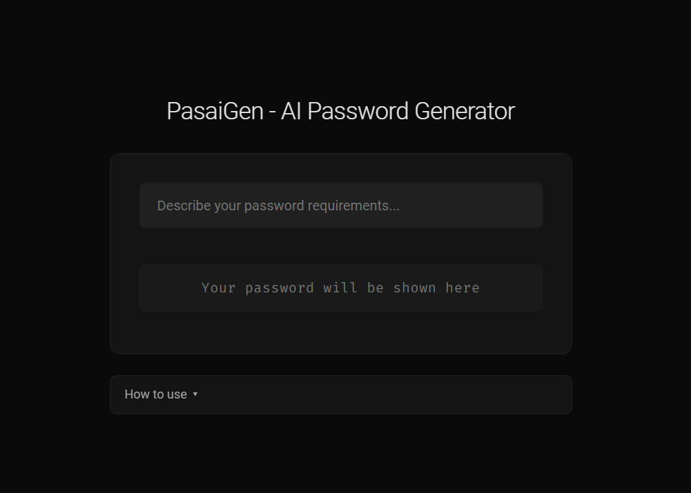

<div style="text-align: center;" align="center">
    <a href="https://github.com/mdonmez/PasaiGen">
        
    </a>
    <br>
    <h1>PasaiGen - AI Password Generator</h1>
    <p>
An intelligent password generator that creates secure passwords from natural language input, eliminating the need for complex configuration while maintaining security standards.
    </p>
    
</div>

## Features

- **Natural Language Input**: Type requirements in plain English
- **Instant Generation**: Real-time password creation with 2-second debounce
- **Auto-Copy**: Passwords automatically copy to clipboard
- **Zero Storage**: Passwords clear automatically after 5 seconds
- **Secure Design**: No password storage, minimal transmission

## Quick Examples

```
"6 uppercase letters" → YQMHSX
"strong password"    → qI=fz",L.5S{D=(t
"4 digit pin"       → 3850
```
## Operation Logic

### Natural Language Processing
- User enters requirements in plain English
- 2-second debounce on input processing
- AI model converts input to password configuration

### Password Generation Flow
- Frontend → Flask backend → AI model
- Secure password generation from parsed requirements 
- Auto-copy to clipboard and 5-second display timeout

### Security Layer
- AI does not generate passwords or see generated passwords at all
- Zero storage policy (server/client)
- Transient clipboard handling
- Auto-clearing UI
- Read-only display
- Secure transmission

### User Experience
- Real-time feedback & loading states
- No interaction required, just write
- Success/error messaging
- Auto clipboard copy
- Clean, responsive interface

## Setup

### Requirements
- Python 3.12+
- OpenAI API key (or compatible)

### Installation

```
git clone https://github.com/mdonmez/PasaiGen.git
cd PasaiGen
pip install -r requirements.txt
```

### Configuration

Create a `.env` file with the following:

```
BASE_URL=your_api_base_url
API_KEY=your_api_key
MODEL_NAME=your_model_name
```

### Usage

```
python app.py
```
Then visit the web user interface to start using the app. (Default: http://127.0.0.1:5000/)

## Technology Stack

### Frontend:
- Vanilla JavaScript
- Modern CSS3
- Responsive Design

### Backend:
- Flask
- Python 3.12+
- OpenAI compitable API Integration

### Infrastructure:
- Render Hosting
- Environment-based Configuration

## Security Features

### Password Handling
- No password storage
- Automatic display clearing
- Secure clipboard operations
- Read-only interface

### Data Protection
- Minimal data transmission
- Environment-based secrets
- Secure API integration

## License

This project is licensed under the MIT License - See [LICENSE](LICENSE) for details.
